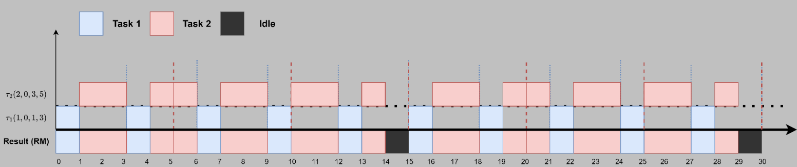
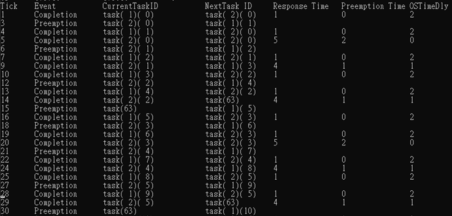
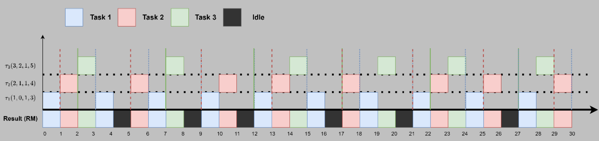
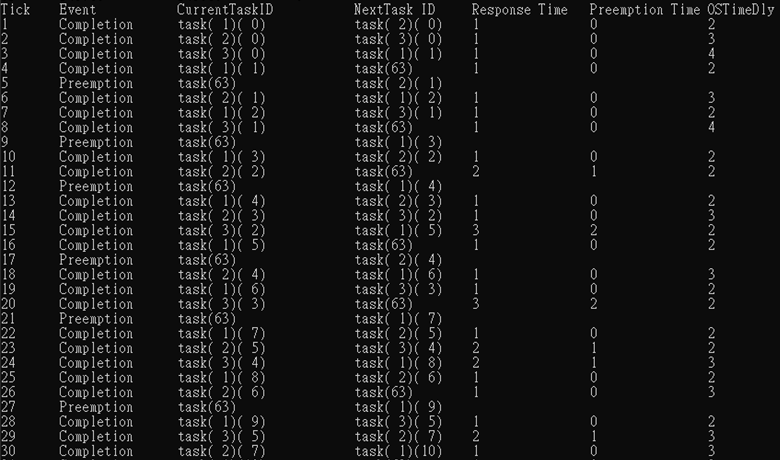
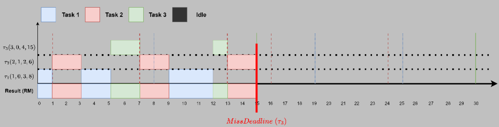
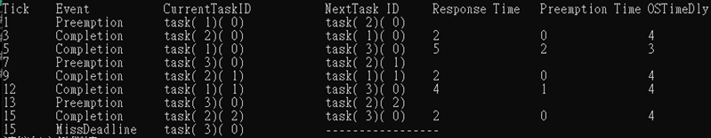
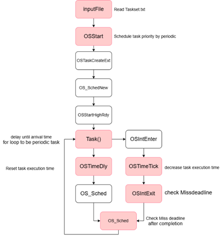

# microC-OSII Rate-Monotonic (RM) Scheduling Algorithm

## Objective
To implement the Rate Monotonic (RM) scheduler for periodic tasks and observe the scheduling behaviors.

## Problem Definition
Implement the following three task sets of periodic tasks. Add necessary code to the μC/OS-II scheduler at the kernel level to observe how the task suffers from the scheduler. We provide the parameter files for the tasks.

### Example Task Set
| Task ID | Arrival Time | Execution Time | Period |
|-----------|--------------|----------------|--------|
| τ1        | 0            | 1              | 3      |
| τ2        | 0            | 3              | 5      |

---

## Output Format

The output of the scheduler will be displayed in the following format:

| Tick | Event         | Current Task ID | Next Task ID | Response Time | Preemption Time | OSTimeDly |
|-------|----------------|-----------------|--------------|---------------|-----------------|-----------|
| 1     | Preemption     | 1 (1)           | 2 (1)        | 1             | 1               | 0         |
| 2     | Completion     | 2 (1)           | 1 (2)        | 2             | 0               | 0         |
| 3     | MissDeadline   | 2 (1)           | ---          | ---           | ---             | ---         |

### Event Description
- **Preemption**: Task with higher priority takes over the CPU.
- **Completion**: Task finishes execution.
- **MissDeadline**: Task failed to complete within its period.
- **OSTimeDly**: Time delayed due to synchronization or wait conditions.

---

## Results

The following figure shows the scheduling result of **Task Set 1** using the Rate Monotonic algorithm.
### Example Task Set 1
| Task ID | Arrival Time | Execution Time | Period |
|-----------|--------------|----------------|--------|
| τ1        | 0            | 1              | 3      |
| τ2        | 0            | 3              | 5      |

---

The following figure shows the scheduling result of **Task Set 2** using the Rate Monotonic algorithm
### Example Task Set 2
| Task ID | Arrival Time | Execution Time | Period |
|-----------|--------------|----------------|--------|
| τ1        | 0            | 1              | 3      |
| τ2        | 1            | 1              | 4      |
| τ3        | 2            | 1              | 5      |
---  

The following figure shows the scheduling result of **Task Set 3** using the Rate Monotonic algorithm
### Example Task Set 3
| Task ID | Arrival Time | Execution Time | Period |
|-----------|--------------|----------------|--------|
| τ1        | 0            | 3              | 8      |
| τ2        | 1            | 2              | 6      |
| τ3        | 0            | 4              | 15     |
---   

## Flow Chart
To implement the Rate Monotonic (RM) scheduler for periodic tasks, we make adjustments to the workflow to ensure it adheres to RM rules and properly handles missed deadlines.

  

  
Basically, we adjust the kernel level or the Time Tick thread to manage most processes, ensuring tasks operate correctly.

## More Details

For more detailed information, please refer to the report:  
[Read the RM Report (RM_report.pdf)](RM_report.pdf)